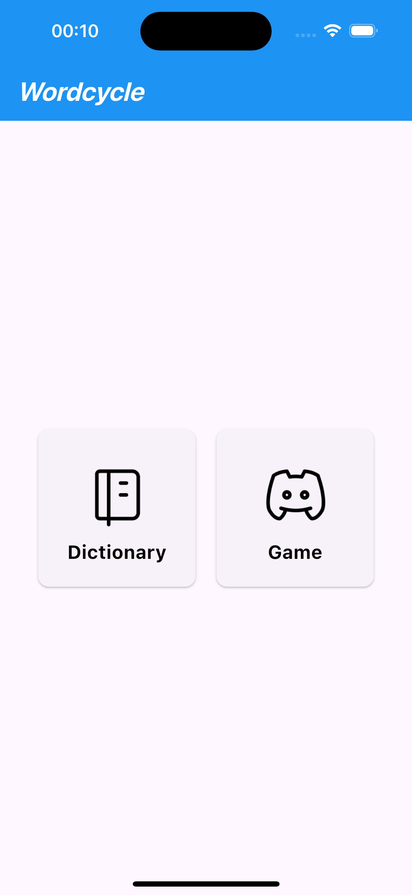
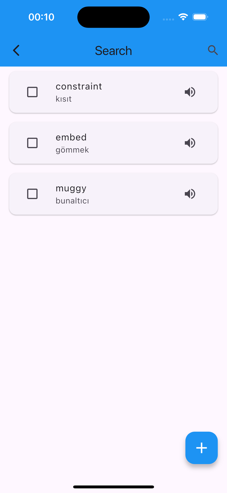
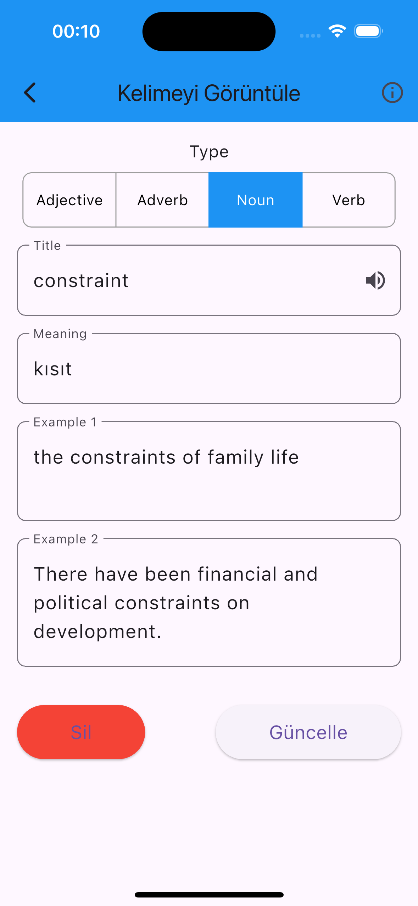
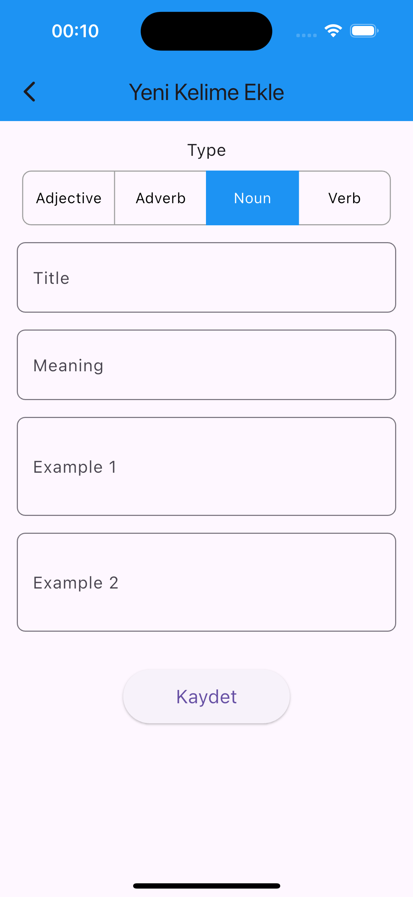
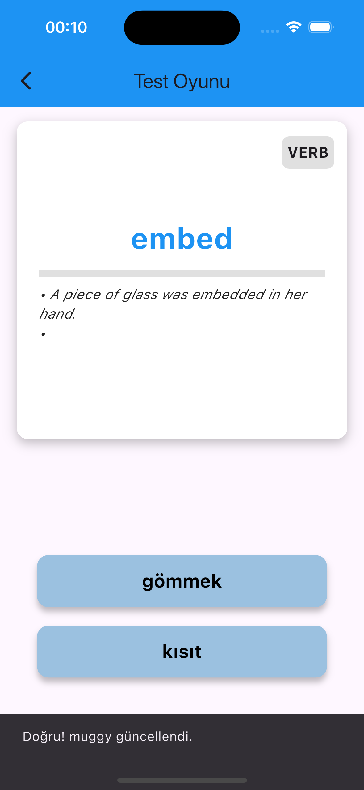
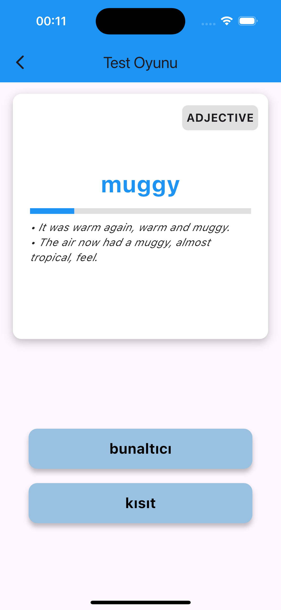

# Vocabulary Learning App

A Flutter-based vocabulary learning application that helps users practice and test their word knowledge. This project integrates with Supabase for database operations and includes features such as adding, viewing, and testing vocabulary words. The app is designed with an intuitive UI and provides interactive ways to reinforce vocabulary learning through games like flashcards and tests.

## Features

- **Word Management:** Add, view, and manage your vocabulary words.
- **Test Game:** Test your knowledge by selecting the correct meaning of words from multiple choices.
- **Progress Tracking:** Track your learning progress with a progress bar based on correct answers.
- **Supabase Integration:** All word data is stored and managed through Supabase.

## Installation

To set up the project, follow these steps:

1. **Clone the repository:**

    ```bash
    git clone https://github.com/your-username/vocabulary-learning-app.git
    cd vocabulary-learning-app
    ```

2. **Add the missing Flutter files:**

   Since the repository only includes the `assets`, `lib`, `data`, and `pubspec.yaml` files, you need to manually add the missing Flutter project files.

   - Create a new Flutter project in your preferred directory:
   
     ```bash
     flutter create .
     ```
   - This will generate the necessary files like `android`, `ios`, `test`, `web`, and others.
   - After generating the files, make sure to copy the `assets`, `lib`, `data`, and `pubspec.yaml` files from the repository to your new Flutter project directory.

3. **Install dependencies:**

    ```bash
    flutter pub get
    ```

4. **Set up Supabase:**

    - Add your Supabase project URL and anon key in the `data/config.json` file.

5. **Run the app:**

    ```bash
    flutter run
    ```

## Usage

- **Add Words:** Use the add word feature to input new vocabulary words.
- **View Words:** Browse through your list of saved words.
- **Play Test Game:** Test your knowledge with a simple test game that tracks your progress.

## Screenshots

<div style="display: flex; flex-wrap: wrap; gap: 10px;">
  
  
  
  
  
  
  
</div>

## Contributing

Contributions are welcome! Feel free to open an issue or submit a pull request.

## License

This project is licensed under the MIT License.
